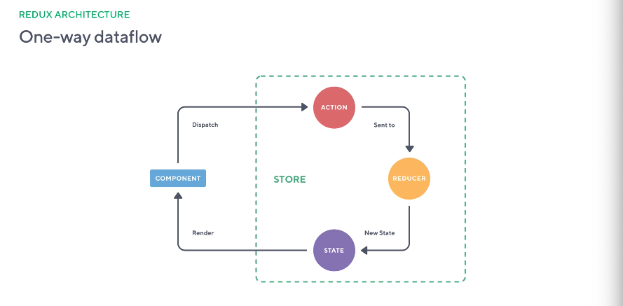

#### What is application state
  * Server response data : Basic CRUD operations in the store
  * User informtaion : Access levels, enrollments for particular user
  * User input : Forms, inputs and also considered application state
  * UI state : We might have a particular toggle or dropdown 
  * Router/location state : URL bar is a source of truth


  'We compose application state in our Store'

#### State Managment Libraries 
  * Model our app state
  * Update state
  * Read state values 
  * Monitor/observe changes to state

#### Redux: Three Principles
1. Single source of truth
    * One state tree inside Store - State for entire application lives in one place;
    * Predictability, maintainability - Since state is located in one place it is much more predictable;
    * Universal apps (SSR) - On the server we can create state represantation of the UI since it is the single object, so we have full represantation of the UI ready when it is rendered, instead of having multiple http calls;
    * Testing and debugging - It will allow us to use time travel debugging and easier to test since it is the pure functions

2. State is read-only
    * Derive properties from state - We are not allowed to overwrite or mutate the state, it is read only;
    * Dispatch actions to change the state - Only way to change the state is dispatch the action;
    * Immutable updates patterns - Instead of mutating the current object return new object;

3. Pure functions update state
    * Pure functions are reducers - Given the same input should return the same output, it does not mutate the object or access the properties;
    * Reducers respond to action types - Pure function are called reducers and only responds to predefined action types; ex. ADD_TODO only adds to do to the array and returns new array;
    * Reducers return new state - When new state is returned all the subscribed components will get that new state;

#### Redux: Core Concepts
 * Single state tree 
    - Plain JS Object
    - Composed by reducers

 * Actions
    - Two properties: 
      * type: string, describes event
      * payload: optional data
    - Dispatch actions to reducers

 * Reducers
    - Pure functions
    - Given dispatched action
      * Responds to action.type
      * Access to action.payload
      * Composes new state
      * Returns new state

 * Store
    - State container
    - Components interact with Store
      * Subscribe to slices of State
      * Dispatch Actions to the Store
    - Store invokes Reducers with previous State and Action
    - Reducers compose new State 
    - Store is updated, notifies subscribers

 * One way data flow

    

#### Understanding Immutability
  * An immutable object is an object whose state cannot be mofified after creation. Instead of adding property to existing object, we get the copy of the object and add the property and return that object;

  * Why Immutability?
    - Predictability
    - Explicit state changes
    - Performance (Change Detection)
    - Mutation Tracking
    - Undo state changes

  * Mutability in JS (Mutable by nature), we need to start thinking in immutable way
    - Functions
    - Objects
    - Array

    ```
    //Objects
    const character = {name: 'Has Solo'};
    Object.assign({}, character, {role: 'Captain'});
    const updatedCharacter = {...character, role: 'Captain'};
    // {name : 'Han Solo'};
    console.log(character):
    // {name : 'Han Solo', role: 'Captain'};
    console.log(updatedCharacter):

    // Arrays
    const names = ['Han Solo', 'Darth Vader'];
    const newNames = [...names, 'R2-D2'];
    // ['Han Solo', 'Darth Vader'];
    console.log(names);
    // ['Han Solo', 'Darth Vader', 'R2-D2'];
    console.log(newNames);
    ```
  * Immutable data types in JS
    - string: 
    ```
    const name = 'Han Solo'
    const uppercaseName = name.toUpperCase()
    // 'Han Solo', 'HAN SOLO'
    console.log(name, uppercaseName)
    ```


